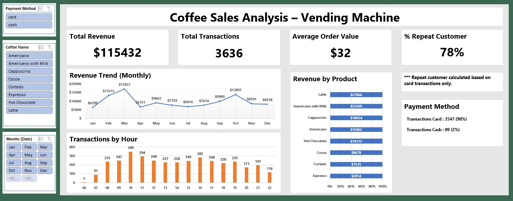

# coffee-sales-analysis
Excel-based sales analysis &amp; dashboard

#  Coffee Sales Analysis – Vending Machine
##  Project Overview

This project analyzes coffee sales data from a vending machine to understand sales performance, customer behavior, and payment trends.
The analysis was conducted end-to-end using Microsoft Excel, from data cleaning to dashboard visualization.

The goal of this project is to demonstrate my ability to:
* Clean and transform raw data
* Define meaningful business KPIs
* Build a clear and professional dashboard
* Translate data into actionable business insights

##  Dataset

* Source: Kaggle – Coffee Sales Dataset
* Data Type: Transaction-level sales data
* Granularity: 1 row = 1 transaction

### Key Fields:
* Transaction Date & Time
* Product
* Payment Method (Card / Cash)
* Card ID (for repeat customer analysis)
* Price / Revenue

 **Note:** The dataset does not provide a native transaction ID, therefore a transaction ID was created based on row number.

##  Data Analysis Workflow

Data Source
→ Data Cleaning
→ Feature Engineering
→ KPI Calculation
→ Dashboard Visualization
→ Business Insight & Recommendation

All steps were performed using Microsoft Excel.

###  Data Cleaning

The following data preparation steps were performed:
* Removed empty and invalid rows
* Standardized date and time formats
* Handled missing customer identifiers
* Identified cash transactions (card_id = "-")
* Trimmed text fields to avoid duplication issues

###  Feature Engineering

Several derived fields were created to support analysis:
* **Transaction ID** – generated using row number
* **Month** – extracted from transaction date for trend analysis
* **Hour** – extracted from transaction time for peak hour analysis
* **Is_Repeat/Exclude_cash** – classified transactions as Repeat / Single / Cash
* **Revenue** – calculated per transaction

###  Key Metrics (KPIs)

The dashboard focuses on the following business KPIs:
* Total Revenue
* Total Transactions
* Average Order Value (AOV)
* Repeat Customer Rate (Calculated based on card transactions only)

###  Dashboard Overview

The Excel dashboard provides a high-level business summary including:
* Monthly revenue trend
* Revenue contribution by product
* Peak transaction hours
* Payment method distribution
* Key performance indicators (KPI cards)

**Dashboard Preview:**

###  Key Insights

Some key insights derived from the analysis:

* The analysis shows a total revenue of **$115,432** over the observed period. Revenue fluctuates across months, with noticeable peaks in **October 2024** and **February 2025**, while January recorded the lowest performance. This pattern suggests potential seasonality, which should be considered for inventory planning and promotional timing.

* Product analysis reveals that **Americano with Milk** dominates sales volume, while **Espresso** shows consistently low demand. This indicates that not all products contribute equally to revenue, and underperforming products may require pricing, positioning, or promotional adjustments.
  
* Analysis shows that **78%** of card transactions originate from repeat customers, demonstrating strong customer loyalty.
Cash transactions cannot be individually identified, so loyalty analysis focuses on card users.

* Payment method analysis shows that card payments account for **98%** of all transactions, indicating a strong preference for cashless payments and highlighting the importance of reliable digital payment systems.
  
* Transaction volume peaks around **10 AM**, likely corresponding to break times or pre-work consumption, while early morning hours show minimal activity.

###  Business Recommendations

Based on the analysis, several business recommendations can be proposed:

* Improve the performance of low-selling products (e.g., Espresso) through bundling, limited-time discounts, or menu repositioning

* Optimize inventory and machine readiness during peak hours, particularly around 10 AM and mid-afternoon

* Leverage high-traffic hours for higher-margin promotions

* Develop card-based loyalty initiatives to further engage repeat customers and increase transaction frequency
  
##  Data Limitations

* Cash transactions cannot be linked to individual customers
* No customer demographic data available
* No promotion or pricing change information provided

##  Tools Used

### Microsoft Excel
* Data Cleaning
* Pivot Tables
* KPI Calculations
* Dashboard Design

#  Author

**AGUSTIANTO**

Aspiring Data Analyst

Indonesia

 LinkedIn: [Agustianto](www.linkedin.com/in/agus-tianto-a305611a5)

 GitHub: [agustianto-lab](https://github.com/agustianto-lab)

##  Final Notes

This project is part of my data analytics portfolio and demonstrates my ability to perform business-oriented analysis using Excel.

Feedback and suggestions are welcome.
