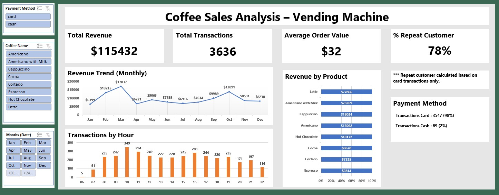

# coffee-sales-analysis
Excel-based sales analysis &amp; dashboard

#  Coffee Sales Analysis – Vending Machine
##  Gambaran Umum

Proyek ini menganalisis data penjualan kopi dari mesin penjual otomatis (*vending machine*) untuk memahami kinerja penjualan, perilaku pelanggan, dan tren pembayaran. Analisis dilakukan secara menyeluruh menggunakan Microsoft Excel, mulai dari pembersihan data hingga visualisasi dasbor.

##  Dataset

* Sumber: Kaggle – Coffee Sales Dataset
* Jenis Data: Data penjualan tingkat transaksi
* Granularitas: 1 baris = 1 transaksi

### Kolom Utama:
* Transaction Date & Time
* Product
* Payment Method (Card / Cash)
* Card ID (for repeat customer analysis)
* Price / Revenue

 **Note:** Dataset tidak menyediakan ID transaksi bawaan, sehingga ID transaksi dibuat berdasarkan nomor baris.

##  Alur Kerja

Sumber Data
→ Pembersihan Data
→ Rekayasa Fitur
→ Perhitungan KPI
→ Visualisasi Dasbor
→ Wawasan & Rekomendasi Bisnis

Seluruh tahapan dilakukan menggunakan Microsoft Excel.

###  Pembersihan Data

Langkah-langkah persiapan data berikut telah dilakukan:
* Menghapus baris kosong dan tidak valid
* Menstandarisasi format tanggal dan waktu
* Menangani identitas pelanggan yang hilang
* Mengidentifikasi transaksi tunai (card_id = "-")
* Membersihkan spasi pada kolom teks untuk menghindari masalah duplikasi

###  Rekayasa Fitur

Beberapa kolom turunan dibuat untuk mendukung analisis:
* **Transaction ID** – dibuat menggunakan nomor baris
* **Month** – diekstrak dari tanggal transaksi untuk analisis tren
* **Hour** – diekstrak dari waktu transaksi untuk analisis jam sibuk
* **Is_Repeat/Exclude_cash** – mengklasifikasikan transaksi sebagai Berulang / Tunggal / Tunai
* **Revenue** – dihitung per transaksi Metrik Utama (KPI)

###  Metrik Utama (KPI)

Dasbor berfokus pada KPI bisnis berikut:
* Total Revenue
* Total Transactions
* Average Order Value / Nilai Pesanan Rata-rata
* Repeat Customer Rate (Dihitung berdasarkan transaksi kartu saja)

###  Gambaran Umum Dasbor

Dasbor Excel ini menyajikan ringkasan bisnis yang mencakup:
* Monthly revenue trend / Tren pendapatan bulanan
* Revenue contribution by product / Kontribusi pendapatan berdasarkan produk
* Peak transaction hours / Puncak jam transaksi
* Payment method distribution / Distribusi metode pembayaran
* Key performance indicators (KPI cards) / Indikator kinerja utama

**Dasbor:**

**Link** [Coffee-sales-Dashboard](https://1drv.ms/x/c/1260dafa43546506/IQCIpYt3F58ETZunHt81uMNqAfHFqYqM_ffAAYzyWn0-9Ts?e=JVBd64)

###  Wawasan Utama

Beberapa wawasan utama yang diperoleh dari analisis:

* Analisis menunjukkan total pendapatan (total revenue) sebesar **$115.432** selama periode pengamatan. Pendapatan berfluktuasi dari bulan ke bulan, dengan lonjakan yang terlihat jelas pada Oktober 2024 dan Februari 2025, sementara Januari mencatat kinerja terendah. Pola ini mengindikasikan adanya potensi faktor musiman yang perlu dipertimbangkan dalam perencanaan inventaris dan penentuan waktu promosi.

* Analisis produk menunjukkan bahwa **Americano with Milk** mendominasi volume penjualan, sedangkan **Espresso** menunjukkan permintaan yang secara konsisten rendah. Hal ini mengindikasikan bahwa tidak semua produk memberikan kontribusi yang sama terhadap pendapatan, dan produk dengan kinerja rendah mungkin memerlukan penyesuaian harga, pemosisian, atau strategi promosi.
  
* Analisis menunjukkan bahwa **78%** transaksi kartu berasal dari pelanggan yang kembali (**repeat customers**), yang mencerminkan loyalitas pelanggan yang kuat. Transaksi tunai tidak dapat diidentifikasi secara individual, sehingga analisis loyalitas berfokus pada pengguna kartu.

* Analisis metode pembayaran menunjukkan bahwa pembayaran dengan kartu mencakup **98%** dari seluruh transaksi, yang mengindikasikan preferensi kuat terhadap pembayaran nontunai serta menyoroti pentingnya sistem pembayaran digital yang baik.
  
* Volume transaksi mencapai puncaknya sekitar pukul **10.00 pagi**, kemungkinan bertepatan dengan waktu istirahat atau konsumsi sebelum mulai bekerja, sementara aktivitas pada pagi-pagi sekali terpantau minim.

###  Rekomendasi Bisnis

Berdasarkan analisis tersebut, beberapa rekomendasi bisnis dapat diajukan:

* Meningkatkan kinerja produk dengan penjualan rendah (misalnya, **Espresso**) melalui strategi *bundling*, diskon terbatas waktu, atau reposisi menu.

* Mengoptimalkan inventaris dan kesiapan mesin selama jam sibuk, khususnya sekitar pukul **10.00 pagi** dan pertengahan sore

* Memanfaatkan jam-jam dengan lalu lintas pelanggan tinggi untuk promosi produk dengan margin keuntungan lebih besar

* Mengembangkan transaksi berbasis kartu untuk lebih meningkatkan keterlibatan pelanggan setia dan frekuensi transaksi
  
##  Keterbatasan Data

* Transaksi tunai tidak dapat dikaitkan dengan pelanggan secara individual
* Tidak tersedia data demografis pelanggan
* Tidak tersedia informasi mengenai promosi atau perubahan harga

##  Alat yang digunakan

### Microsoft Excel (PivotTable, formula, dasbor)
* Data Cleaning / Pembersihan Data
* Pivot Table
* KPI Calculation / Perhitungan KPI
* Desain Dasbor

#  Author

**AGUSTIANTO**

Indonesia

 LinkedIn: [Agustianto](https://linkedin.com/in/agus-tianto-a305611a5)

 GitHub: [agustianto-lab](https://github.com/agustianto-lab)

